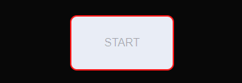

# Do you know Al

# Goal for this Project
 "Do you know Al"

 Do you know Al is an online quiz that will give the user the opportunity to the test their knowledge on the aaclaimed actor, through different difficluty while the actor gives his input back on each question and final verdict on the total score.

# UX

## User Goals
* Straight to the point on being able to start the quiz on minimal option to start the quiz.
* Having an easily understandable structure that flows linear.
* Being able to see how I performed on the quiz
* Having the option to test on different difficulty 
* To have an enjoyable time participating in the quiz

## User Stories
* As a user, I want to see my progression of my score during and after the quiz is finished.
* As a user, I want to have a custom username that is visually throughout the quiz.
* As a user, I want to be able to test myself on different difficluty of the quiz.
* As a user, I want to be able to restart the quiz when I finish the quiz, so I can test myself on another difficulty.
* As a user, I want the question to be factually correct.

## Site Owners Goals
* To create a single page website that doesnt need to reload.
* To have audio cue's of Al Pacino giving feedback on the perforamnce of the user during and after the quiz.
* To have the user give their username and selected difficulty before the quiz begins.
* To make the quiz fun and enjoyable.
* To tally the score and the current question.
* To have an visually appealing site that is easy on the eyes.

### Requirements
* Reponsize design, that will be based on mobile-first.
* To have the quiz on a single page layoust.
* To have high contrast color palette that will be beneficial for peolpe with low vision. 
* Give feedback on performance on the quiz
* To have the audio cues to reflect the performance of the user input.

### Expections
* I expect that the correct question load when difficulty is selected.
* I expect the quiz to score the question correctly.
* I expect the right audio to play when determine if the question is right or wrong.
* I expect the user to be given their correct score at the end of the quiz and audio given in the range of their score.
* I expect screen size not to affect the quality of the quiz
* I expect the username to be displayed during the quiz and after the quiz ends.
* I expect the quiz to tally the score and the current question the user is on.

## Design Choices

### Fonts
I have used [Google Fonts](https://fonts.google.com/ "Google Fonts") to change my fonts from the standard fonts that are supplied in VS Code. The fonts that have used are [Playfair Display](https://fonts.google.com/specimen/Playfair+Display?query=playfair) which will be the main font of the quiz, reasons for using it are for its simple quality and easy on the eyes readability. The other font that I will use is [Poppins](https://fonts.google.com/specimen/Poppins?query=poppins), reasons for using it are for the placement on the main header so it can stand out from the main body font.
### Colors
In deciding what color I want to use for my website, I wanted to base it on the theatrical released poster for the movie Scarface that starrted Al Pacino. The main color code for the poster is the two tone of black and white while the font is dark red with the outline of the lettering is gold. When deciding how to implement these color in my quiz my main reference will be the poster. The website I used to comlpy these colors was [color-hex](https://www.color-hex.com/). I used [WebAIM](https://webaim.org/) to check if the contrast would pass the test if the colors where compatible. The result for the main two color that will be used are [here](wireframe/contrast-checker-1.png). Other result for secondary color are [here](wireframe/contrast-checker.png) and [here](wireframe/contrast-checker-2.png).

the colors that will be using are as following:
* #FF1919 (red) This will be used for borders, checked answers and box shadow. 
* #e9edf6 (white) This will be used for the majority of the font of the quiz, the buttons and the outside of the quiz.
* #080808 (black) This will be used as the background color of all the containers 
* #ffdb00 (gold) This will be used for the color of the main header of the quiz and the box shadow for the difficulty if selected.   
### Structure
I will be building my website with a mobile-first approach. Using the Chrome developer tools to give me the iPhone 4 (320px), I will use this as the smallest screen size for styling.

| Screen Size | Breakpoint |
| ----------- | ---------- |
| x-small     | <475px     |
| small       | => 576px   |
| medium      | => 768px   |
| large       | => 992px   |
| x-large     | => 1200px  |
# Wireframe

To make a blueprint for my quiz, I used the [Balsamiq](https://balsamiq.com/wireframes/). I only created one wireframe for mobile, reason being that the tablet and desktop version of the quiz will be very simler in layout and structure.

[Mobile Wireframe](wireframe/do-you-know-al-wireframe.bmpr)

# Features

## Existing Features

### Welcome Screen
The quiz when first opened will display the welcome screen. The content portrayed will give the user the needed information on what the quiz is about and also detail what is needed to start the quiz. The content will be displayed center on the screen for all screen sizes.

* Visual for welcome screen on mobile screen.

* Visual for welocme screen on tablet screen.

* Visual for welcome screen on desktop screen.

To start the quiz two requirements must be met, a username must be place in the text input box and a difficulty must be selected for the start button to become active.

* Visual for text box when not selected.

* Visual for text box when selected will light up the border to indicated to the user that they can input text, even when selected the button will still be disable due no text being inputed and also accounting for whitespace not being allowed.

* Visual for difficultys when not selected.

* Visaul for difficulty when selected will demostrate the background change color to indicate to the user that it is selected.

* Visaul for start button when disabled.

* Visual for start button when button is active after the two requirements are met.

### Quiz Section
The quiz section holds the following content of the current question of the difficulty, its potential answers, the username, the current question out of 10 question, the score out of 10 question and the submit button. These element stay constant throughout the entirely of the 10 question that are being asked. I oringally wanted to place the header for the quiz in this section but felt it made the screen space very cluttered so decided to option it out.

* Visual for quiz section that stays consistent throughout screen sizes.

* Visaul for the counter box that will update every time a question is anwer. 

* isual for updated counter box showing the user has got questions wrong out of the number of question done. Helpfully for the user to see their progress in the quiz and how many question they have to answer left.

* Visual for the username that is enter in the welcome screen that is place throught the quiz section until it ends.

* Visual of the layout of the question and choice of answers 

* Visual of how the user views the answer choices with the submit button being disabled. THis will stop the user being able to continue in the quiz until the a potential anser is selected.

* Visual of how the user views the anwser when an anwser choices is selected with resulthing in the submit button being enable. Allowing the user to go to the next question.

### Result Screen
Once the quiz has been completed the user will be shown his score on the result screen. The result screen will give the information of the username that was inputted at the start of the quiz, the number of questions they correctly answered out of 10, a message that will be determined on their score, and also audio also determined on the score. There are 5 different messages and audio clip that will depend on the result they scored in the quiz. Result message and audio play are as followed. 

* 10 out of 10

[audio](assets/audio/winning.mp3)

* Greater than or equal to 8 out of 10

[audio](assets/audio/al-give-me-all%20you-got.mp3)

* Greater than or equal to 5 out of 10

[audio](assets/audio/something.mp3)

* Greater than or equal to 3 out of 10

[audio](assets/audio/what-to-say.mp3)

* equal to 0 out of 10

[audio](assets/audio/al-dont-waste-mytime.mp3)

*On each result page regardless of the score will have try agin button that will reload the quiz back to the welcome page.

## Features to be Implemented

Features that I would like to add to the quiz are adding a countdown timer for each question and having certain audio play when a question is correct or incorrect.

# Technologies Used

## Languages
* [HTML](https://en.wikipedia.org/wiki/HTML "HTML")
* [CSS](https://en.wikipedia.org/wiki/CSS "CSS")
* [JavaScript](https://en.wikipedia.org/wiki/JavaScript)

## Libaries & Framework
* [Google Fonts](https://fonts.google.com/ "Google Fonts")

## Tools
* For construction and deployment [Gitpod](https://www.gitpod.io/ "Gitpod")
* For wireframes [Balsamic](https://balsamiq.com/wireframes/ "Balsamic")
* For HTML validation [W3C HTML Validation Service](https://validator.w3.org/ "W3C HTML")
* For CSS validation [W3C CSS Validation Service](https://jigsaw.w3.org/css-validator/ "W3C CSS")
* For JS syntax validator [Esprima](https://esprima.org/demo/validate.html "Esprima")
* For complying color hex [color-hex](https://www.color-hex.com/)
* For color contrast test [WebAIM](https://webaim.org/)
* For audio [YouTube](https://www.youtube.com/)
* For audio converter [YT2MP3](https://yt2mp3.info/?l=en)
* For audio splitter [MP3cut](https://mp3cut.net/)
* For spell checking [Grammarly](https://chrome.google.com/webstore/detail/grammarly-for-chrome/kbfnbcaeplbcioakkpcpgfkobkghlhen/related?hl=en "Grammarly")

# Testing

## Layout and Content

* My result from lighthouse in devtool.

* My result from The W3C Markup Validation Service.

* My result from The W3C CSS Validation Service.

* My result from Esprima Syntax Validator.

![JavaScript]

When initially designing my wireframe for my quiz I wanted to keep my quiz to a simple standard and not complicated with images and unnecessary clutter. With the finished product, I feel that I have kept to that standard. The option to not include images was a difficult one as I felt it would give little interactive media to the quiz. I resolved this by including the audio of Al Pacino to add that touch of means to the quiz. One change that I feel also helped the quiz be not cluttered was the removal of the header in the quiz section that at the time of its placement made it feel that too much information was being thrown at the user.

Originally I had the answers in a grid of two rows with two columns to give space for the header but once I had the emission of the header I reverted it to a single column using flex to fill up the space. This help in having no empty space for visual purpose.

Another design change was 

## JavaScript

This being the first time I have built a JavaScript project I ran into a couple of problems that resulted in a lot of changes. Originally I built a quiz that had three separate arrays of questions based on difficulty. I wanted to then do an if loop for when the difficulty was checked it would display the question. The problem I ran into was that when I clicked the difficulty it would only display the first question of the easy, medium array and then show the rest of the hard questions. 

This resulted in me changing how I would find my question by filtering the question into a single array of questions and then looking for the key of difficulty. I also change how I would display my question by cloning the template of the quiz by using cloneNode, but when I went to try and score the quiz I was getting repeat values for an answer. So I had to figure out another way of getting and displaying my question. 

This is where I used the Durstenfeld shuffle so it could shuffle the values that I needed to output with a change of my potential answers being put in an array inside the array. so it could look for the value of the answer.